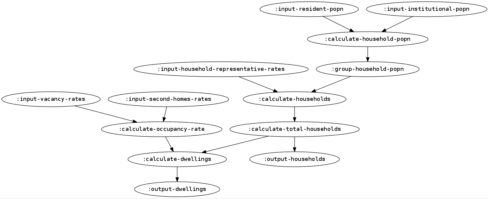

# witan.models.household


## Description

`witan.models.household` is a Clojure library to create household projections based on population projections.

See [`witan.models.demography`](https://github.com/MastodonC/witan.models.demography) for a Clojure library to build population projections.

The process used in the model follows the conversion of population projections to households and to dwellings.

It goes through the followings steps:




## Development tools

`witan.models.household` is being build to run on MastodonC's [Witan](http://www.mastodonc.com/products/witan/) platform and is thus designed to be executed using the workspace executor defined in [`witan.workspace-executor`](https://github.com/MastodonC/witan.workspace-executor) library.

The model is being built using the [`witan.workspace-api`](https://github.com/mastodonc/witan.workspace-api) library to create the right structure (workflow, catalog, library) for the model to be run using the workspace executor.

### Creating the model workflow

While creating a workflow from a model flowchart it can be useful to compare the model flowchart with a flowchart created out of the model workflow.

This can be by following those steps:

1) Install `Graphviz`:

- Ubuntu: `$ sudo apt-get install graphviz`

- MacOS: `$ brew install graphviz`

For any OS you should also be able to install it with "pip": `$ pip install graphviz`.

2) Use the `view-workflow` function using the household model workflow (hh-model-workflow)
as follows:

```Clojure
(witan.workspace-executor.core/view-workflow hh-model-workflow)
```

### Running the model in the workspace executor

The test namespace currently checks the model can actually be run by the workspace executor.

When running the model in the workspace executor from the repl it's very useful to turn on the logs for the model, using:
```Clojure
(witan.workspace-api/set-api-logging! println)
```

## License

Copyright © 2016 MastodonC Ltd

Distributed under the Eclipse Public License either version 1.0 or (at
your option) any later version.
